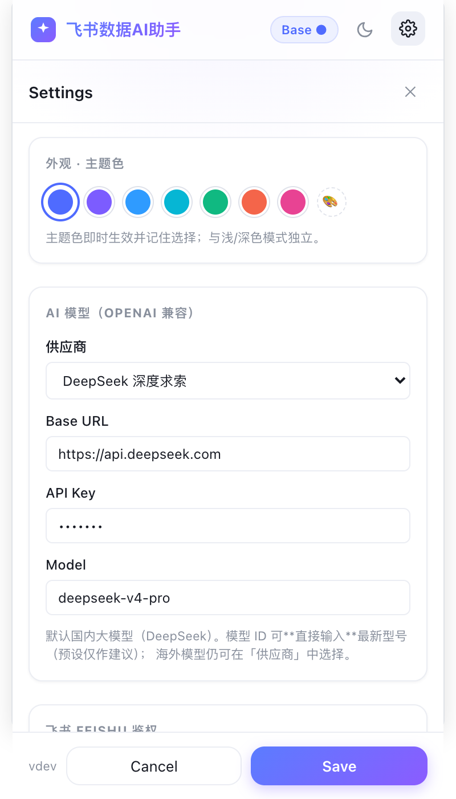
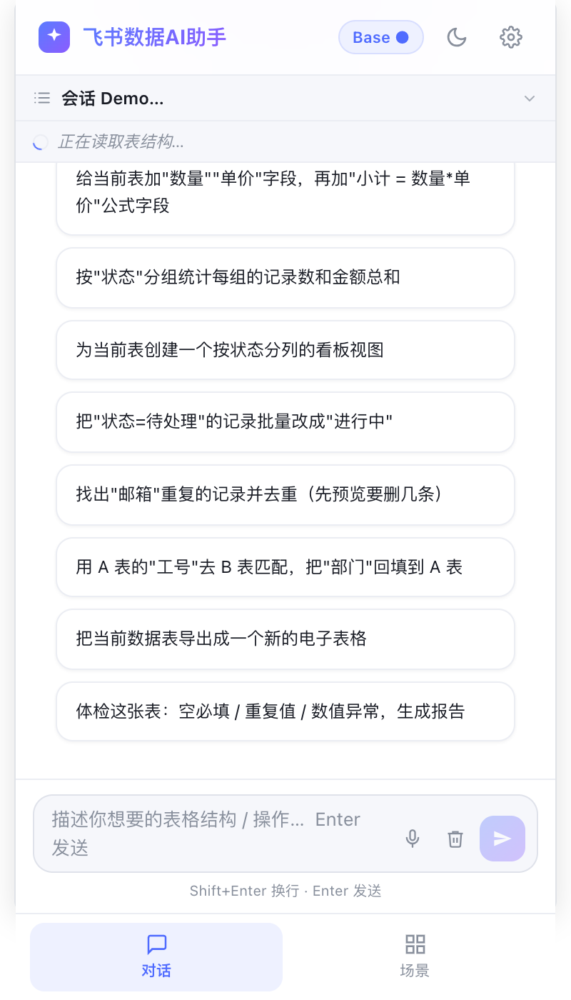
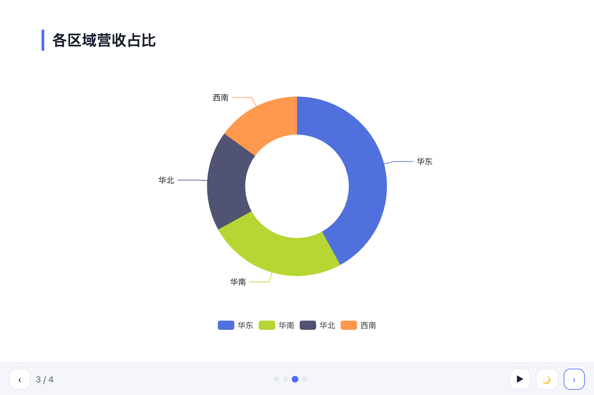
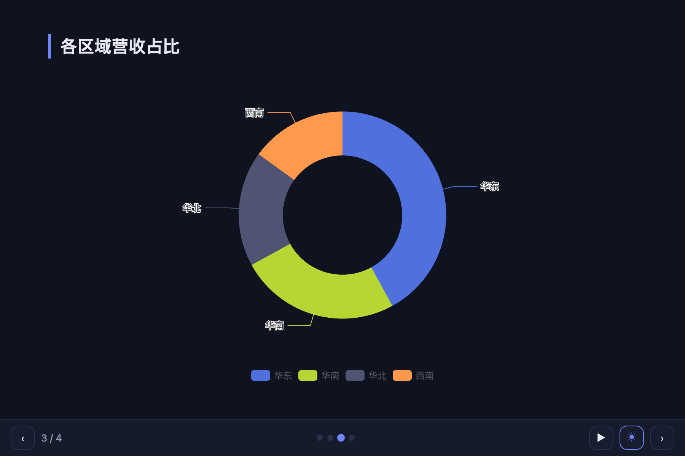

> 🌐 [English](USER_GUIDE.en.md) | **中文**

# 飞书文档AI助手 · 功能使用手册

> 一个 Chrome 侧边栏扩展：在飞书的**多维表格 / 电子表格 / 文档**页面里，用一句话让 AI 帮你
> 建表、填数、写公式、做图表、生成网站、写分析报告、做 PPT、总结/体检文档……**无后端，全部以你本人的身份操作**。
>
> 本手册的截图取自内置 UI 预览（`npm run dev:ui`），与实际侧边栏一致。

---

## 目录

1. [安装与首次配置](#1-安装与首次配置)
2. [整体界面：对话 / 场景](#2-整体界面对话--场景)
3. [对话：用自然语言操作飞书](#3-对话用自然语言操作飞书)
4. [场景：按当前页面智能分组的能力中心](#4-场景按当前页面智能分组的能力中心)
5. [把数据做成页面：AI 小程序 / AI 建站](#5-把数据做成页面ai-小程序--ai-建站)
6. [数据加工与分析：智能填充 / 数据分析报告](#6-数据加工与分析智能填充--数据分析报告)
7. [文档处理：文档体检 / 文档总结](#7-文档处理文档体检--文档总结)
8. [🎞️ AI 幻灯片（文档/表格转 PPT）— 重点](#8--ai-幻灯片文档表格转-ppt-重点)
9. [搭建 / 建库：场景模版库](#9-搭建--建库场景模版库)
10. [网页采集：剪藏 / 抓取 / 识别 / 导入](#10-网页采集剪藏--抓取--识别--导入)
11. [常见问题（FAQ）](#11-常见问题faq)

---

## 1. 安装与首次配置

**第一步 · 安装（二选一）**

- 🟢 **从 Chrome 网上应用店安装（推荐 · 免构建）**：打开 👉 **[Chrome 网上应用店页面](https://chromewebstore.google.com/detail/eplcnheinfmkcckelinolhpdagbamdcc)** → 点「**添加至 Chrome**」。装好后点工具栏的扩展图标（可右键固定）即可。**省掉克隆 / 构建 / 加载**——但本扩展**不内置凭据**，装好后需在设置里填**你自己的**飞书 App ID / Secret（见第三步）。
- 🛠 **开发版 / 自行构建**：`chrome://extensions` → 打开「开发者模式」→「加载已解压的扩展程序」→ 选 `dist/` 目录（或安装 `.crx`）。适合二次开发 / 想用自己的飞书应用 / 私有化，步骤见 [`QUICKSTART.md`](QUICKSTART.md)。

**第二步 · 唤出侧边栏**：打开任意飞书页面（多维表格 / 电子表格 / 文档），点扩展图标唤出**侧边栏**。

**第三步 · 首次配置**：顶部会出现 **"Configure API keys to get started"**，点它进入「设置」：

在设置里需要：

| 项 | 说明 |
| --- | --- |
| **自建飞书应用（App ID / App Secret）** | 商店版 / 不内置凭据版**必填**：在「**自建飞书应用**」区填**你自己的** App ID + App Secret → 点「保存应用凭据」→ 按提示把**回调地址**（设置里会自动显示，形如 `https://<扩展ID>.chromiumapp.org/`）登记到飞书后台「安全设置 → 重定向 URL」。怎么创建应用 / 开权限 / 发布见 [`QUICKSTART.md`](QUICKSTART.md)。 |
| **模型服务商 / Base URL / 模型** | OpenAI 兼容接口，默认中国大模型 **DeepSeek**。可换成任意兼容服务。 |
| **API Key** | 大模型的密钥（`sk-…`）。仅存本机、加密保存。 |
| **大模型配置来源**（企业版） | 企业统一下发时这里有「企业统一 / 手动」开关：选**企业统一**则**无需填 Key**，用本企业飞书账号授权后自动获取（管理员可锁定为仅企业统一）。个人版只有手动配置。 |
| **飞书授权** | 用你的飞书账号授权，取得 `user_access_token` 与 `open_id`。助手**始终以你本人身份**操作，绝不越权。 |
| **主题色 / 深浅色** | 顶部可切换浅色/深色（☀/🌙），并可挑主题色。 |
| **越用越聪明 / 语音输入 / 自动确认** | 可选项：是否从历史提炼经验、是否启用语音、是否跳过破坏性操作的二次确认。 |

> 🔒 安全：所有密钥/令牌都加密存储在本机 `chrome.storage`，不上传任何服务器。权限边界**硬编码在代码里**，删除整张表/文档等"文件级删除"被直接禁止。

> ℹ️ **本扩展始终用「你自己的」飞书应用**（BYO，安装包里零凭据，无论商店版还是自建版）。商店版省掉的是构建/加载，**飞书应用仍需你自己建一次**：在 [open.feishu.cn](https://open.feishu.cn) 建一个企业自建应用 → 开通所需权限（都勾「用户身份」）→ 把自己加入「可用范围」并发布；回调地址用扩展设置里显示的那串。完整一次性步骤见 [`QUICKSTART.md`](QUICKSTART.md)。大模型 Key 同样由你在设置里填、只存本机。

---

## 2. 整体界面：对话 / 场景

侧边栏顶部是品牌名、**当前页面类型徽标**（Base / 电子表格 / 文档 / 知识库…）、深浅色与设置；底部是两个 Tab：

- **对话** —— 和 AI 自由对话，让它直接操作当前飞书页面。
- **场景** —— 一键能力中心，按你**当前打开的页面**智能排序与分组。

打开一个飞书页面时：支持的资源默认进入「对话」，其它页面默认进入「场景」。

---

## 3. 对话：用自然语言操作飞书

在「对话」里直接说需求即可，例如"新建一个项目管理表，含名称/状态/负责人/截止日期"。AI 会调用约 50 个工具完成多维表格（建改表、字段、视图、记录增改删、结构化搜索）、电子表格（读写区间、填列、查找替换、行列增删）、文档（Markdown 转文档、插入内容块、按评论改稿）等操作，并支持去重 / 跨表查找 / 条件批量更新 / 表→表汇总 / 审计。

- 首屏会根据**当前页面类型**给出"能做什么"的引导与一键示例。
- 破坏性 / 批量写操作（删除、`按条件批量改`、`跨表回填`等）会弹出**确认卡**，点按钮确认后才执行（可在设置里开启"自动确认"跳过）。
- 点飞书表格里的字段/单元格，其文字会自动填进输入框，方便精确描述要改哪里。

---

## 4. 场景：按当前页面智能分组的能力中心

「场景」不是一堆扁平的卡片，而是**上下文感知**的：顶部状态条显示"当前页面：多维表格 / 电子表格 / 飞书文档…"，下面按"做什么"分组，**与当前页匹配的能力排在最前并高亮，用不了的能力整组置灰下沉并标注"需…"**——避免点进去才发现用不了。

**在多维表格 / 电子表格页：**

**在飞书文档页（文档能力浮到最前，表格能力下沉置灰）：**

分组一览：

| 分组 | 能力 | 适用页面 |
| --- | --- | --- |
| 把数据做成页面 | AI 小程序、AI 建站 | 多维表格 / 电子表格 |
| 数据加工与分析 | 智能填充、数据分析报告 | 多维表格 / 电子表格 |
| 文档处理 | 文档体检、文档总结 | 飞书文档 |
| 演示 / PPT | **AI 幻灯片** | 文档**或**表格 |
| 搭建 / 建库 | 场景模版库 | 任意 |
| 网页采集 | 剪藏 / 全量抓取 / 截图识别 / 文件导入 | 任意网页（右键触发） |

---

## 5. 把数据做成页面：AI 小程序 / AI 建站

> 都是"一句话把当前表变成页面浮窗"，可保存、下次用最新数据一键打开；离线自包含、不联网。

### AI 小程序

把当前表做成**图表 / 报表 / 看板 / 计算器 / 幻灯片**，渲染成页面上的悬浮窗。交互（筛选联动、搜索/排序/分页、可编辑单元格写回、行级建任务）都由插件可靠实现。

### AI 建站

把当前表做成一个**完整网站页面**（英雄区 + 指标 + 图表 + 明细），可"导出飞书文档"、"推送到群"。

> 生成后会在飞书页**左下角出现半透明浮窗药丸**，点击即可展开/收起；保存过的还会一直在那里，换数据一键重开。

---

## 6. 数据加工与分析：智能填充 / 数据分析报告

### 智能填充

选某一列，AI 参考同行其它列推断**空缺的值**（分类 / 打标签 / 归类 / 补全），**预览后一键写回**多维表格。

### 数据分析报告

读当前表的数据，AI 写一篇**带真实数字**的分析报告（摘要 / 关键发现 / 趋势 / 建议），自动生成飞书文档并附上源数据表。

---

## 7. 文档处理：文档体检 / 文档总结

### 文档总结

通读当前文档，按你的要求生成总结（摘要 / 要点 / 待办…）。**总结要求可自定义、本机持久化**。

### 文档体检

通读当前文档，AI 找出**逻辑断点 / 未定义术语 / 前后矛盾 / 遗留 TODO / 过期数据 / 空小节**，给出可定位清单。

---

## 8. 🎞️ AI 幻灯片（文档/表格转 PPT）— 重点

把当前**飞书文档**或**多维表格 / 电子表格**先总结 / 分析，再做成**多页、可翻页的 PPT**，渲染在页面浮窗里——尽量接近真正的 PPT。属于 AI 建站的一种输出。

### 8.1 入口与生成

在文档或表格页 → 场景 →「演示 / PPT」→ **🎞️ AI 幻灯片**：

- 可填**额外要求**（如"侧重结论与风险""控制在 10 页内""面向管理层"），点 **生成幻灯片**。
- AI 会先在内部总结/分析内容，再排成 8–16 页的演示，自动选版式：封面、章节页、要点、双栏对比、关键数字、图表、金句结论。
- 生成过程有实时进度（已生成 N 字）、计时与"取消"。

### 8.2 翻页与放映

生成后在页面浮窗里就是一套 PPT：

| 操作 | 方式 |
| --- | --- |
| 翻页 | `← / →`、`Space`、`PageUp/Down`、`Home/End`；**点幻灯片左右两侧**；底部 `‹ ›` 按钮 |
| 跳页 | 底部**圆点**直接点 |
| 进度 | 左下角 `当前 / 总页数` |
| **自动播放** | 底部 **▶**（每 5 秒翻一页、循环；手动翻页会重置计时）；再点变 **⏸** 暂停 |
| **深浅色** | 底部 **☀ / 🌙** 一键切换（只作用于幻灯片，不影响侧边栏） |
| **配色调整** | 浮窗标题栏 **🎨** 取色器，任选主题色 → PPT/图表/标题/圆点实时换色；**↺** 恢复默认。对 网站 / 看板 / 图表 同样适用 |
| **导出 PDF** | 浮窗标题栏 **🖨**，按"一页一张"导出整套 |

**封面页（浅色）：**

**数据页用图表呈现（更像真正的 PPT）：**

**一键切换深色：**

### 8.3 数据用图表展示

对于文档里的数据指标、以及电子表格 / 多维表格，AI 会**优先用图表**（饼 / 柱 / 折线 / 条形）呈现分布、占比、趋势、排名，而不是干巴巴的文字——这样才像真正的 PPT。图表只用从真实数据里数得出来的数字，不编造。

### 8.4 复用已保存的看板（表格专属）

在多维表格 / 电子表格上生成 PPT 时，会自动把你**已保存的看板（AI 小程序 / 仪表盘）**作为幻灯片附在末尾，用最新数据实时渲染——不必重新做图。

### 8.5 针对某一页调整

不满意某一页？在面板的「**调整某页**」里填**页码** + 一句话要求（如"这页改成饼图""精简为 3 条""换个标题""加一句结论"），点「调整这页」，AI 只重做这一页、其余不动，并立即重新展示。

### 8.6 保存为模版，下次免生成

生成后点 **⭐ 保存**，会进入面板里的「**我的演示**」列表（见 8.1 截图）。下次进来直接点列表里的演示，**不调用大模型、免生成**即可重新放映；表格类演示会自动用最新数据刷新其中的看板页。

---

## 9. 搭建 / 建库：场景模版库

一键搭建 **CRM / 电商 / 项目管理** 等多维表格（含表结构、示例数据、仪表盘）。可在设置里配置远程模版库地址获取更多。

- 顶部可搜索、按分类筛选。
- 点卡片进入详情，可配置参数、选择"新建应用 / 当前 Base"，再「开始创建」。
- 创建过程有分步进度，失败可重试。

---

## 10. 网页采集：剪藏 / 抓取 / 识别 / 导入

在**任意网页**上右键触发，把内容整理后写入飞书（需在构建中开启 `CLIP_ENABLED`）：

| 能力 | 触发 |
| --- | --- |
| 网页剪藏 | 右键「剪藏到飞书」→ 表格 / 选中内容 AI 整理后写入多维表格 / 电子表格 / 文档 |
| 全量抓取 | 右键「剪藏整张表（滚动加载全部行）」→ 抓取虚拟滚动表格的所有行 |
| 截图识别 | 右键「截图识别到飞书」→ 视觉模型识别 canvas / 图片里的表格（需配置视觉模型） |
| 文件导入 | 把 CSV / 表格文件直接**拖进侧边栏** → AI 整理后写入飞书 |

---

## 11. 常见问题（FAQ）

**Q：侧边栏提示"请先在飞书页面使用"？**
A：助手只在飞书页面（多维表格 / 电子表格 / 文档 / 知识库）工作。打开对应页面即可；也可把 CSV 拖进来。

**Q：切到别的浏览器标签再回来，生成的内容会丢吗？**
A：不会。AI 小程序 / 建站 / 幻灯片的生成结果会按页面缓存，回来后自动恢复（"已恢复上次生成的…"），无需重做；保存过的还在"我的网站 / 我的演示 / 看板药丸"里。

**Q：在「知识库（Wiki）」里打开的表格，浮窗药丸不显示？**
A：已支持——插件会自动把 Wiki 解析成它背后的真实表格/文档再匹配。若长时间识别不出，直接打开文档/表格本体即可。

**Q：登录失效了怎么办？**
A：顶部会出现"飞书登录已失效，请重新登录"横幅，点它回到设置重新授权即可；进行中的操作会给出明确提示，不会误报"请先打开表格"。

**Q：幻灯片导出的 PDF 不对/是空白？**
A：请用浮窗标题栏的 **🖨** 导出（会同步搭建"一页一张"的打印版，图表也会包含）；导出的是浮窗里的幻灯片本身，不含页面其它内容。

**Q：会把我的数据发给大模型吗？**
A：只有完成你明确发起的任务时，才把**必要的、有上限的**数据发给你自己配置的大模型；单次工具结果有字符上限以限制外发量。所有飞书读写都以你本人身份、按需进行。

---

### 附：开发者自检

| 检查 | 命令 | 结果 |
| --- | --- | --- |
| 类型检查 | `npm run typecheck` | ✅ 通过 |
| 单元测试 | `npm test` | ✅ 343 passed / 32 skipped |
| UI 冒烟测试 | `npm run test:ui` | ✅ 11/11 通过 |
| 生产构建 | `npm run build` | ✅ 成功 |
| 截图生成 | `node scripts/capture-screenshots.mjs` | ✅ 13 张 → `docs/screenshots/` |